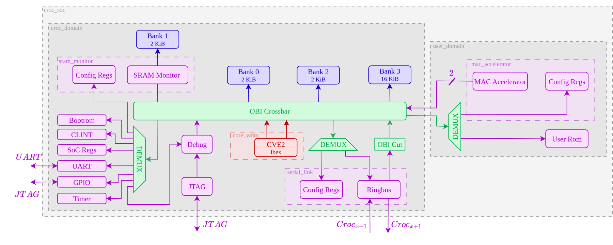
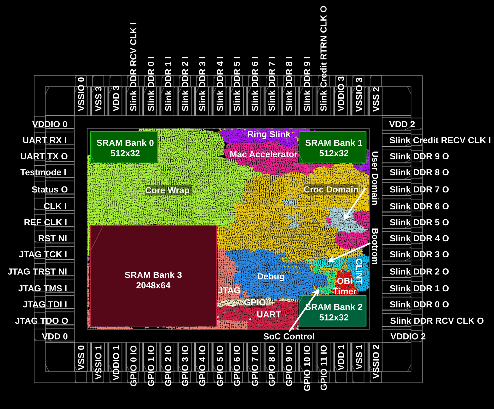
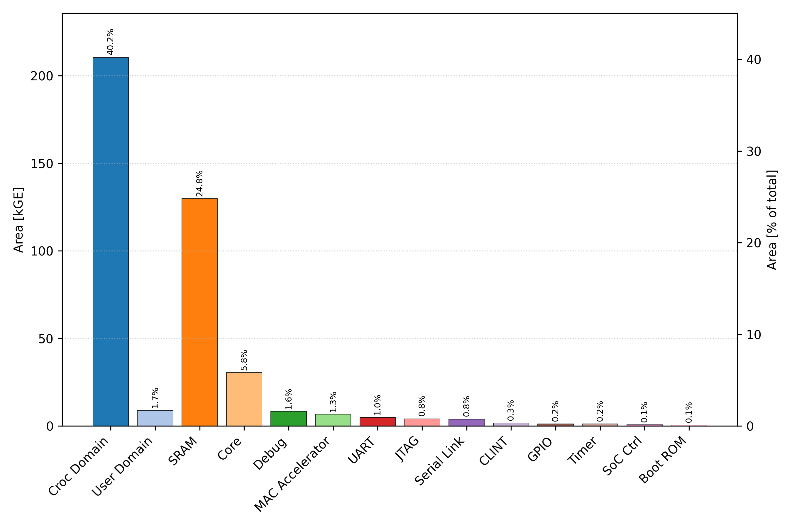
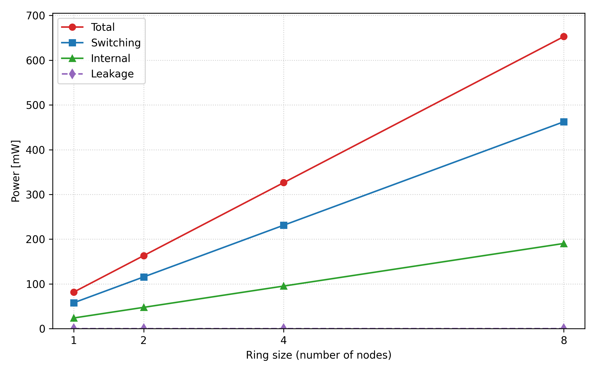

# Ring_Slink — Ringbus for Inference Acceleration

This repository contains **Ring_Slink**, a chip designed by **Fabian Aegerter** and **Maximilian Kocher** in the course **[VLSI 2](https://vlsi.ethz.ch/)** at **ETH Zürich** (Spring 2026, Integrated Systems Laboratory).

The chip has been manufactured and is part of the **ETH Zürich chip gallery**: [asic.ethz.ch/2026/Ring_Slink.html](http://asic.ethz.ch/2026/Ring_Slink.html)

**Full project report:** [Ringbus for Inference Acceleration](doc/report.pdf) — the analytical cost model, register maps, and detailed measurement results.

It is based on [Croc](https://github.com/pulp-platform/croc), a simple RISC-V SoC for education built from PULP IPs, and extends it so that **multiple chips can be coupled into a unidirectional ring bus to distribute machine-learning inference workloads** (matrix-vector multiplication $y = \mathbf{W} \cdot x$) across up to 14 (or 15 nodes depending on configuration). Each node additionally contains a dedicated **MAC accelerator** to speed up local computation.

## Chip Facts

| | |
|---|---|
| Technology | IHP 130 nm (EZ130 8T standard-cell library) |
| Die size | 2500 × 2000 µm incl. sealring (2416 × 1916 µm core) |
| Complexity | ~523 kGE |
| System clock | 80 MHz |
| Ring link | 1 channel, 10 lanes, DDR, clock division 4 |
| Tapeout | Spring 2026 |

## Concept

A large weight matrix $\mathbf{W}$ is partitioned row-wise across all chips in the ring. The initiator node (node 0) distributes the matrix partitions and broadcasts the input vector $x$ over the ring; every node then computes its partial result $y_i = \mathbf{W}_i x$ and forwards it hop-by-hop back to the initiator. Since computation scales as $O(n^2)$ while communication scales as $O(n)$, larger matrices yield disproportionately greater speedups — in simulation up to **15.6×** for a 16 kB weight matrix on 13 nodes, and a theoretical **66.6×** for a 224 kB matrix distributed over 14 chips (vs. a hypothetical single-chip baseline of equal memory).

## Design Additions on Top of Croc

- **Ring Serial Link** (`rtl/serial_link`): a modified version of the [Ring Serial Link IP](https://github.com/faegerter/Ring-Serial-Link). It transports OBI transactions between the SoCs in a unidirectional ring; the four most significant address bits select the target node. Modifications for this chip ([global_payloads branch](https://github.com/faegerter/Ring-Serial-Link/tree/global_payloads)):
  - New **global write payload** type: write to *every* node in the ring with a single transaction, without write responses (used to broadcast $x$ and configuration).
  - Widened from 8 to **10 lanes** and tightened payload packing (4 address MSBs live only in the header), reducing write payloads from 5 to 4 cycles (20% speedup).
- **MAC accelerator** (`rtl/user_domain/mac_accelerator`): a 3-stage pipelined multiply-accumulate unit computing $y = \mathbf{W}x$ row by row. Two parallel OBI manager ports fetch $W[i]$ and $x[i]$ simultaneously from separate SRAM banks, sustaining one MAC per cycle. Controlled via a small OBI register file; raises interrupts on row completion and when all remote results have been received.
- **SRAM monitor** (`rtl/sram_monitor`): counts accesses of a configurable type to a configurable address range of an SRAM bank and raises an interrupt when a threshold is reached. Used to detect when the broadcast of $x$ (or the return of all partial results) has finished.
- **Hardware multiplier**: the CVE2 core is configured with `RV32MFast` (stock Croc uses `RV32MNone`) so the software baseline does not fall back to slow multiply emulation.


## Architecture



The SoC is composed of two main parts:

- The `croc_domain` — a CVE2 core (a minimal fork of Ibex), four SRAM banks (3× 2 kB + 1× 16 kB), the OBI crossbar, the standard peripherals (UART, GPIO, timer, CLINT, JTAG debug module, bootrom) and, added for this project, the **Ring Serial Link** (with its config registers and an OBI pipeline cut on its manager port) and the **SRAM monitor**. The crossbar was substantially expanded to route the additional managers (the serial link and the MAC accelerator's two OBI ports), which makes the `croc_domain` one of the largest blocks on the chip.
- The `user_domain` — the **MAC accelerator** (with its control registers) and a user ROM.

The main interconnect is OBI ([spec](https://github.com/openhwgroup/obi/blob/072d9173c1f2d79471d6f2a10eae59ee387d4c6f/OBI-v1.6.0.pdf)). The various base IPs come from other PULP repositories and are managed by [Bender](https://github.com/pulp-platform/bender); only the used building blocks are vendored into `rtl/<IP>`.

## Memory Map

| Start Address   | Stop Address    | Description                                      |
|-----------------|-----------------|--------------------------------------------------|
| `32'h0000_0000` | `32'h0004_0000` | Debug module (JTAG)                              |
| `32'h0200_0000` | `32'h0200_4000` | Bootrom                                          |
| `32'h0204_0000` | `32'h0208_0000` | CLINT peripheral                                 |
| `32'h0300_0000` | `32'h0300_1000` | SoC control/info registers                       |
| `32'h0300_2000` | `32'h0300_3000` | UART peripheral                                  |
| `32'h0300_5000` | `32'h0300_6000` | GPIO peripheral                                  |
| `32'h0300_6000` | `32'h0300_7000` | SRAM monitor                                     |
| `32'h0300_A000` | `32'h0300_B000` | Timer peripheral                                 |
| `32'h0300_B000` | `32'h0300_C000` | (optional) DMA configuration                     |
| `32'h0400_0000` | `32'h0400_5800` | Memory banks (3× 2 kB + 1× 16 kB SRAM)           |
| `32'h0FFF_E000` | `32'h0FFF_F000` | User domain (MAC accelerator registers, user ROM)|
| `32'h0FFF_F000` | `32'h1000_0000` | Ring Serial Link configuration registers         |
| `32'h1000_0000` | `32'hFFFF_FFFF` | Ring window: 4 address MSBs select the target node |

## Flow


1. Bender provides a list of SystemVerilog files
2. Yosys parses, elaborates, optimizes and maps the design to the technology cells
3. The netlist, constraints and floorplan are loaded into OpenRoad for Place & Route
4. The design as def is read by KLayout and the geometry of the cells and macros are merged

### Implementation Results

|Module placement and pinout                                  |  Area per module                        |
|:-----------------------------------------------------------:|:---------------------------------------:|
| |  |

Average power grows linearly with the number of nodes in the ring (simulated running the MAC accelerator benchmark; a single node draws ~82 mW):



## Requirements

The flow runs in the docker container maintained by Harald Pretl ([IIC-OSIC-TOOLS](https://github.com/iic-jku/IIC-OSIC-TOOLS)); the supported version is 2025.12.

```sh
# Linux only (starts and enters docker container in shell)
scripts/start_linux.sh
# Linux/Mac (starts VNC server on localhost:5901)
scripts/start_vnc.sh
# Windows (starts VNC server on localhost:5901)
scripts/start_vnc.bat
```

Alternatively, install the tools natively: [Bender](https://github.com/pulp-platform/bender#installation), [Yosys](https://github.com/YosysHQ/yosys#building-from-source), [Yosys-Slang](https://github.com/povik/yosys-slang), [OpenRoad](https://github.com/The-OpenROAD-Project/OpenROAD/blob/master/docs/user/Build.md) and optionally [Verilator](https://github.com/verilator/verilator) or Questasim/Modelsim.

On ETHZ systems, the internal PDK integration can be set up with `icdesign ihp13 -nogui` (configured via `.cockpitrc`), or enter the pre-installed container with `oseda bash`.

## Getting Started

To run the synthesis and place & route flow:

```sh
git submodule update --init --recursive
cd yosys && ./run_synthesis.sh --synth
cd ../openroad && ./run_backend.sh --all
cd ../klayout && ./run_finishing.sh --gds
```

To simulate with Verilator:

```sh
cd sw && make all
cd ../verilator && ./run_verilator.sh --build --run ../sw/bin/helloworld.hex
```

With Questasim/Modelsim:

```sh
cd vsim && ./run_vsim.sh --build --run ../sw/bin/helloworld.hex
```

All `run_` scripts have a `--help` you can use to orient yourself.

For simulation, `scripts/simulate.sh` is an end-to-end helper that covers most simulation needs: it builds the requested test program and runs it through either the Verilator or QuestaSim flow, on the multi-node ring testbench (`tb_croc_soc_ring`) or the single-node standard testbench (`tb_croc_soc`), in RTL or post-layout (optionally SDF-annotated) configuration, with configurable ring size and MAC test parameters:

```sh
# e.g. MAC accelerator benchmark on a 4-node ring
scripts/simulate.sh --test mac_accel --num-nodes 4
# all options
scripts/simulate.sh --help
```

### Software Tests

`sw/test/` contains unit tests for the peripherals and the design additions, most notably:

- `test_mac_accel.c` — MAC accelerator functionality
- `test_serial_link.c` — Ring Serial Link transactions
- `test_sram_monitor.c` — SRAM monitor thresholds and interrupts

## Acknowledgements

- [Croc SoC](https://github.com/pulp-platform/croc) — the base SoC, developed as part of the PULP project, a joint effort between ETH Zürich and the University of Bologna
- [Ring Serial Link](https://github.com/faegerter/Ring-Serial-Link) — [Fabian Aegerter](https://github.com/faegerter) and [Llorenç Muela Hausmann](https://github.com/llorenc-m)
- The Integrated Systems Laboratory (IIS) at ETH Zürich for the VLSI 2 course, tapeout preparation and manufacturing

## License

Unless specified otherwise in the respective file headers, all code checked into this repository is made available under a permissive license. All hardware sources and tool scripts are licensed under the Solderpad Hardware License 0.51 (see `LICENSE.md`). All software sources are licensed under Apache 2.0.
